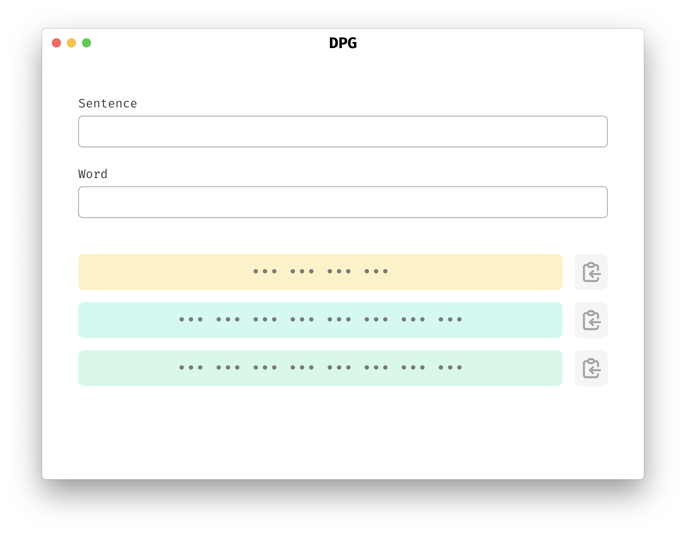

# DPG – Deterministic Password Generator

Electron app and JavaScript implementation. See [dpg](https://github.com/62726164/dpg).

**Todo**
- Click output to copy (instead of it being a separate button).
  - After hovering on output for a couple seconds, show tooltip that says "Click to copy".
- Show/hide output.
- Dark mode 🙄
